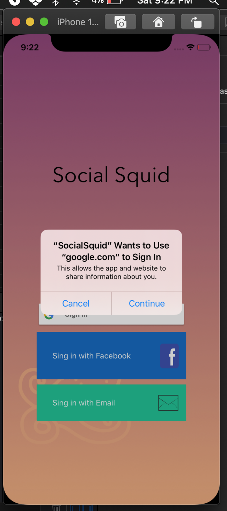

## Social Squid Card Game ♠️

O Social Squid é um card game, as pontuações se dão de qual carta possui maior pontuação (como um joquenpô).
The Social Squid is a card game, the scores are given from which card has the highest score.

This code was iniciated for my studies, based on the tutorial, teaching swift to [CodeWithChris](https://www.youtube.com/user/CodeWithChris). It was implemented "draw" game and also Google login in the game.

Used in this project:

- Swift programming language; 
- Storyboards;
- Auto layout;
- UIAlertController;
- Xibs (to build a customized views);
- GoogleSingIn.

---

### How to use

- Clone this repository;
- Open in Xcode and run.

## Screenshots

<table>
	<tr>
		<th width="33.3%">
			LaunchScreeen 
		</th>
		<th width="33.3%">
			Login Google
		</th>
    <th width="33.3%">
			Movie Card Game
		</th>
	</tr>
	<tr><!-- Prevent zebra stripes --></tr>
	<tr>
		<td>
			
		</td>
		<td>
			
		</td>
    <td>
			
		</td>
	</tr>
</table>

---
